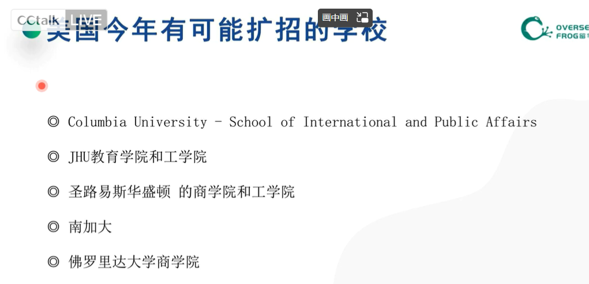

[French school holidays: important dates for the family | Expatica](https://www.expatica.com/fr/education/children-education/school-holidays-in-france-137325/)

[Calendrier scolaire | Ministère de l'Education nationale et de la Jeunesse](https://www.education.gouv.fr/calendrier-scolaire-100148)

一般是电子送分，提前一周送分即可

纸质送分，时间则相对较长，官网送分要提前一到两周

推荐信不要晚于 dll 之后的两周

很多需要电子的官方成绩单

2.确定了学校的截止日期后：（例如1月15日截止）

争取在1月10号进行网申递交

1月5日进行成绩和成绩单递送

争取在12月10日就能开始文书写作，如果时间紧凌，也尽量至少提前两周开始文书写作
因此：

1月5日开始送成绩的话，标化成绩就需要在12月25前考完，出分大约需要7-10天
成绩单如果是邮寄，需要跟邮寄公司确定送达时间，通常为5-7天；

港大注意事项：

1.港大申请系统和上传系统是分开的，注意递交时间不要压线： 

Round1:12:00noon（GMT+8)，October14，2022
Round2:12:00noon（GMT+8)，December2，2022

2.商科上传系统要求加申请编号，请不要忘记；

Thank you for submitting an application foradmission to a postgraduate degree programme at HKU.Please note the reference numberabove and quote itin all future
correspondence.Tohelp usprocessyourapplication efficiently，pleaseensure that this
reference numberismarked oneach page of the supporting documents submitted.For
details regarding thesubmission of supporting documents，please referto：
https://sweb.hku.hk/tola/servlet/ApplicantDownloadForm/getForm？

3.注意让交writingsample的项目不要忘记

英国项目注意事项：

rolling审核制度的学校要早交

G5以及王曼爱华建议带雅思申请

爱大申请递交后记得开系统、递交申请费；推荐信能网推就网推

Toget started，youwill need to register for MyEd.
How to register：
1.Click on the following link orcopy and paste it into your browser:
https://www.myed.ed.ac.uk
2.Click on the'Set up your University Login linktocreate youraccount using the
registration details below
3.AfterregisteringforMyEd，click theManagemy application'button atthe top of the
MyEd homepage
4.Familiarise yourself with the different sections of the Applicant Hub
Your registration details

3.将计划申请的所有学校列出来，做好时间表，再往前推算各个材料需要在什么时间点准备好就大功告成了！

申请季到了分数还没刷出来，应该怎么办

英港新竞争激烈，建议有分再交，不要急于一时

美国申请分数过坎再交，可以后续再刷分补成绩

线下被取消，线上先考

Step 1 申请国家，专业方向

Step 2 选校，冲刺，保底
