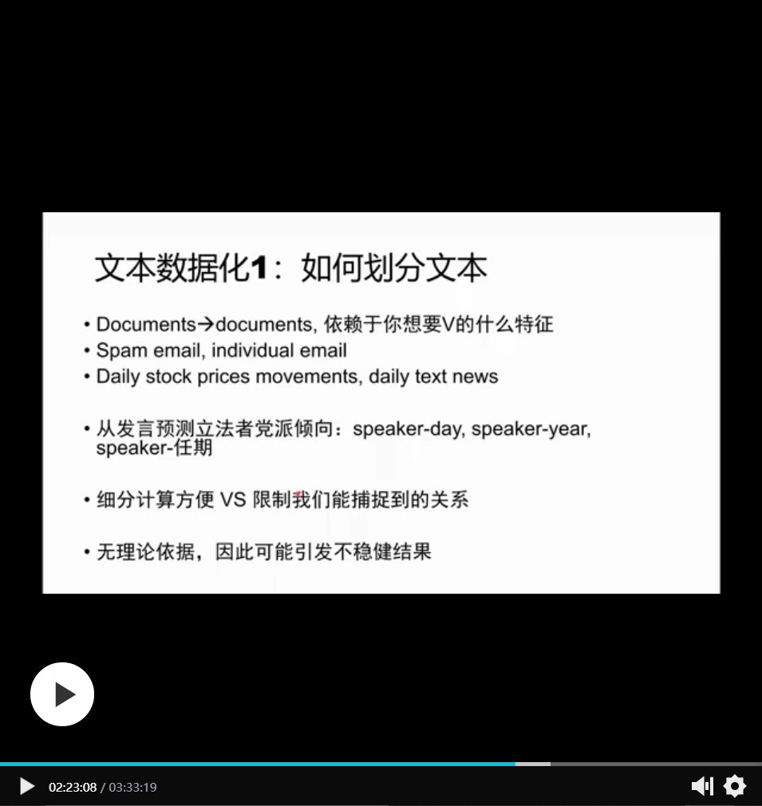

<!--more-->

RESSET财经文本智能分析平台地址：http://rtas.resset.com
账号：gxc   密码：gxc

参考书籍：

1. 基于Python的智能文本分析；Python文本分析（原书第2版）；Benjamin等，2019-12-01，中国电力出版社
2. Python文本分析（原书第2版），迪潘简·萨卡尔（Dipanjan Sarkar），2020-10-01，机械工业出版社
3. 文本分析与文本挖掘，姜维，2018-12-01，科学出版社
4. Python应用实战：爬虫、文本分析与可视化，张丽，2020-03-01，电子工业出版社

大数据主要来源：

- 电商平台
- 搜索引擎
- 社交媒体

Term: 词典，不可重复

Word: 文档，可重复

$$
Similarity =\frac{F \cdot I}{\|F\|\|I\|} 
$$
其中

$$
\|F\|=\sqrt{\sum_{i=1}^{N S} F_{i}^{2}},\|I\|=\sqrt{\sum_{i=1}^{N S} I_{i}^{2}}
$$

几何含义：向量夹角的余弦值。

应用：

- 通过Similarity辅助企业所属行业分类，行业判断

如何获取文本数据?
- 新闻（国外的平台）: Ravenpack | Factiva,
- 上市公司文档
    - 美国：证监会SEC官网

- 锐思数据库+WRDS（来自沃顿商学院的数据库）+CNRDS（数据库）
- 报纸: WSJ（华尔街日报）+人民日报
- DIY网络爬虫: urllib.request.urlopen.read () + selenium
- 分析师报告

## 文本分析的一般流程

学术研究中应用文本分析的一般流程：

- Document→numerical array C（计数）
- C→估计研究种感兴趣的变量$ \hat{V}$（例如：是否是垃圾邮件）
- 用$ \hat{V}$进行进一步的研究，如描述统计、因果推断等。

Step 1：原始数据清洗+初步降维

- 文本数据具有高维度的特征，维度为字数的基本字符个数次幂
- 对Token计数（字、词、句、笔画、音节等）得到 array C
- 删除最常见/最生僻的词，以及一些无意义的对象，例如转义字符
- 选择有意义的文字作为研究对象

Step 2：深度降维 C→$ \hat{V}$

- 应用统计学方法
- 例如：
    - 邮件分类：V = 1 | 0，垃圾 | 正常
    - 客户评价分类：V = 1 | 0 | -1，正面 | 中性 | 负面

Step 3：经济分析

- 重要的是预测能力而非机制（为什么有些词能够预测）。
    - 利用Google搜索，预测经济变量（Scott & Varian 2014, 2015）
    - 分析新闻媒体文本与国会议员的演讲的相似性，从而度量媒体的政治倾向(Groseclose and Milyo 2005)
    - 新闻文本的情感分析，预测股票走势
    - 媒体报道是股价变化的原因吗？
        - 媒体报道与股价变化在理论上应该是同步的
        - 处于报道盈余公告的媒体所在地的投资者交易明显增加

