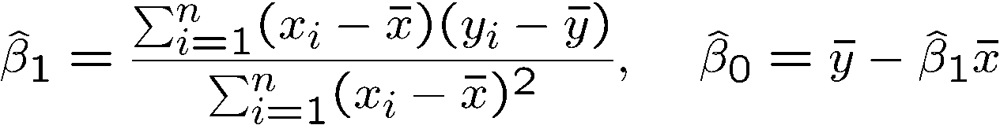
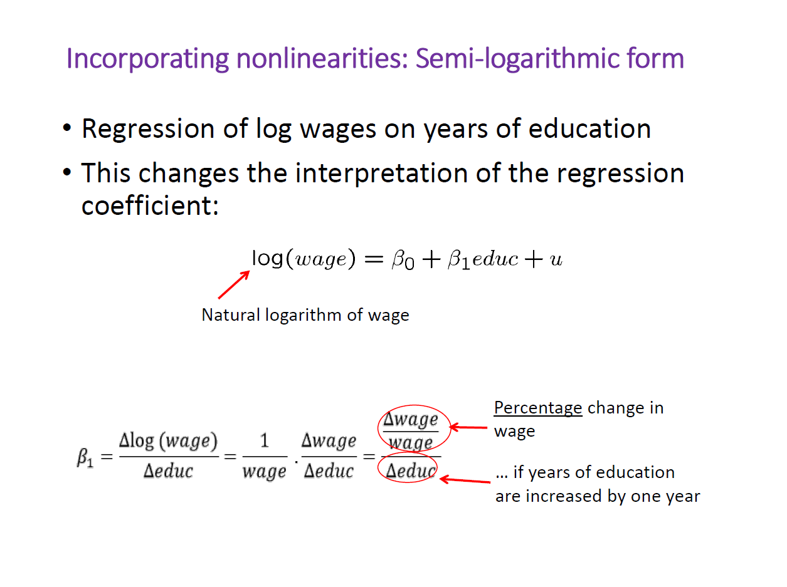
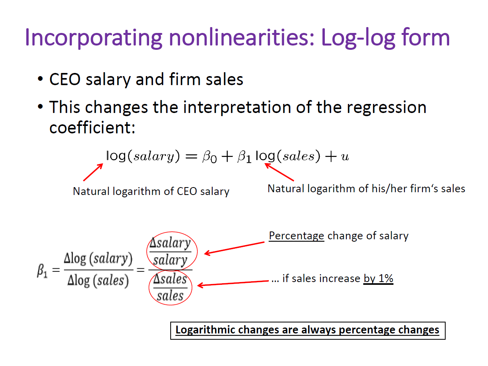
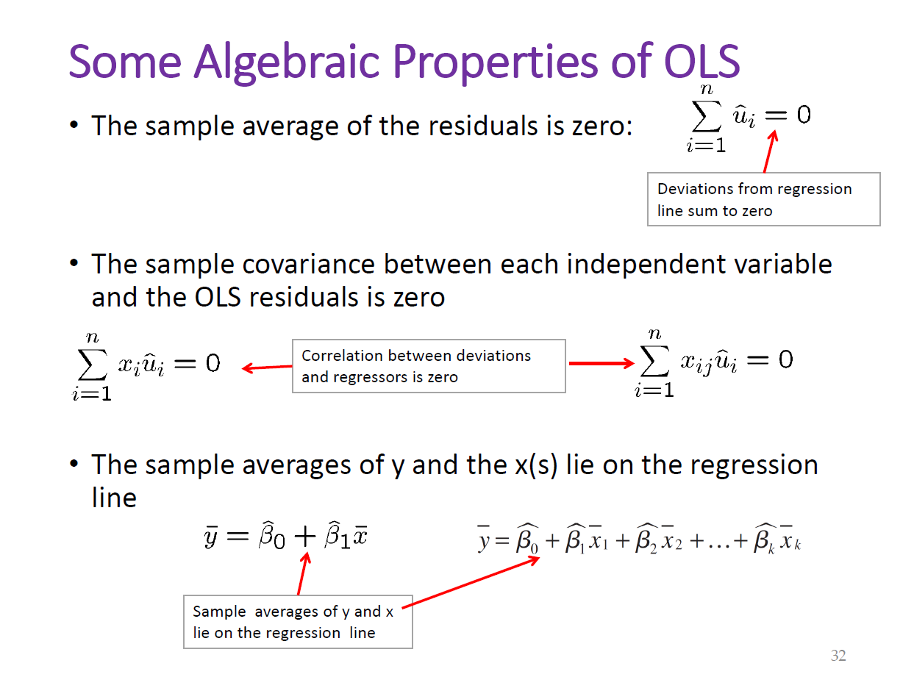

<!--more-->

•
AssumptionSLR.1 -Linear in parameters
•
AssumptionSLR.2 -Random sampling
•
AssumptionSLR.3 -Sample variation in explanatory variable
•
AssumptionSLR.4 -Zero conditional mean

AssumptionSLR.5 (Homoskedasticity)

AssumptionSLR.6 norm

•Expected values/unbiasedness under MLR.1 –MLR.4
•Variance formulas under MLR.1 –MLR.5
•Gauss-Markov Theorem under MLR.1 –MLR.5
•Exact sampling distributions/tests under MLR.1 –MLR.6